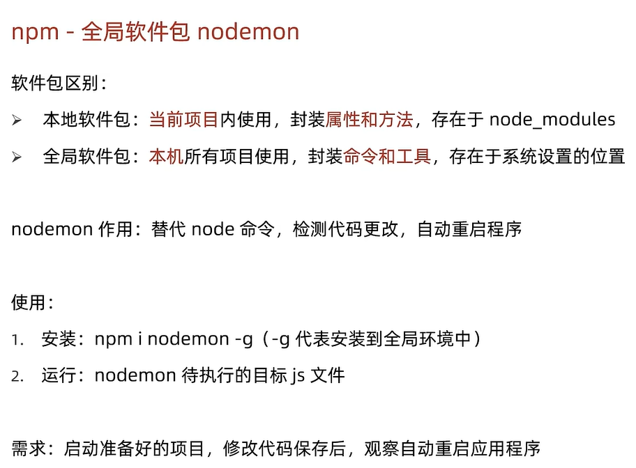
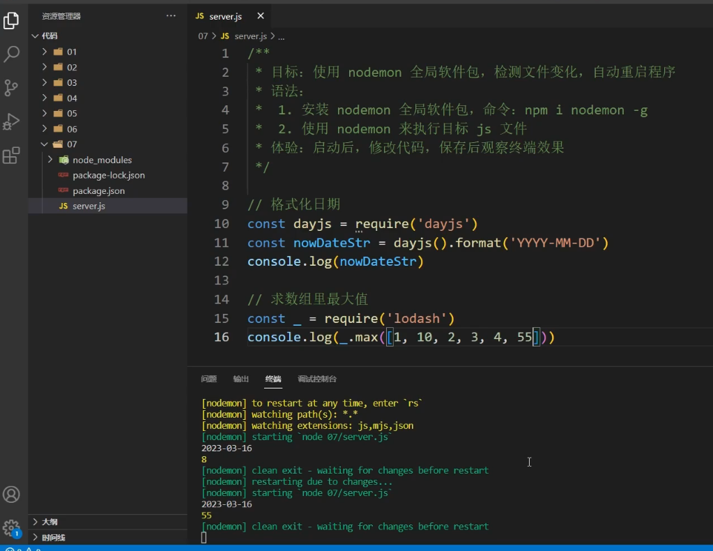

Nodemon 是一个用于 Node.js 应用程序的工具，它可以自动监视文件的变化，并在文件变化时自动重启 Node.js 服务器。这对于开发过程中的效率提升非常有帮助，因为开发者不需要手动停止和重启服务器。

### 主要特点

1. **自动重启**：当监视的文件发生变化时，Nodemon 会自动重启服务器，节省了手动操作的时间。
2. **灵活配置**：可以通过命令行参数或配置文件指定需要监视的文件类型和目录。
3. **支持多种文件**：Nodemon 可以监视 JavaScript、JSON、HTML 等文件类型的变化。
4. **脚本集成**：可以在 `package.json` 中定义 Nodemon 脚本，方便使用。

