String概述
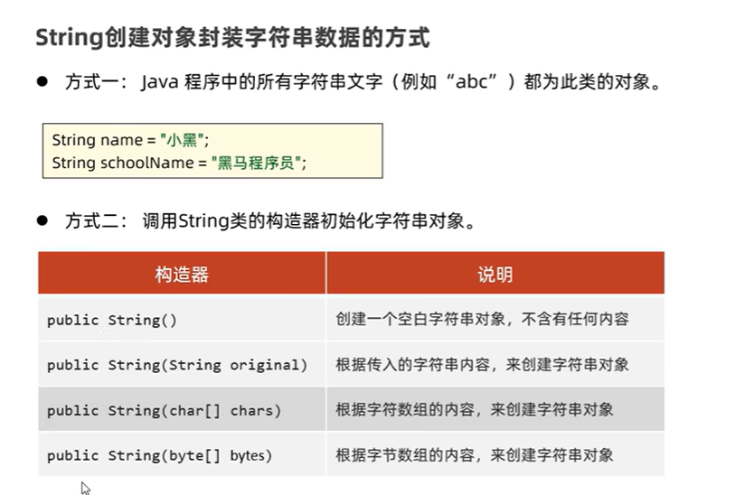
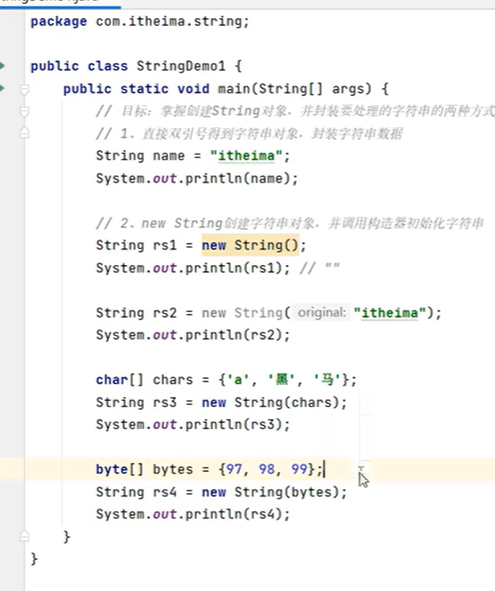
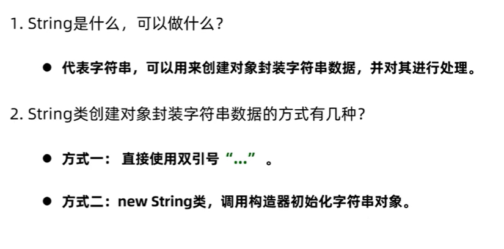

String常用方法
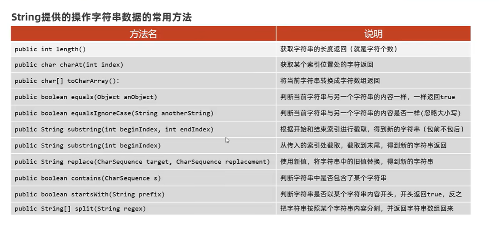

String注意事项
一.
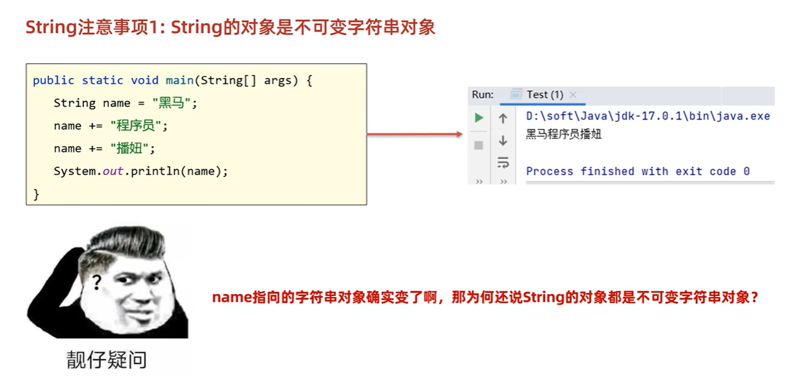
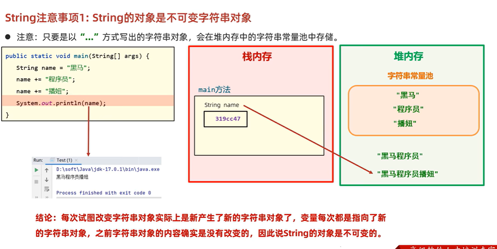
二.
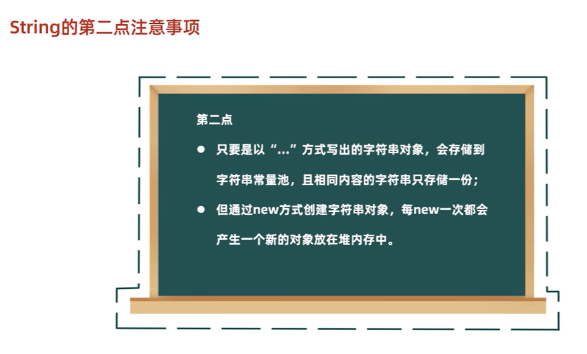
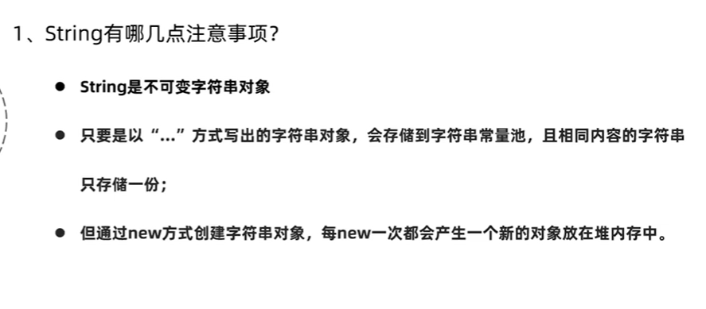

****案例
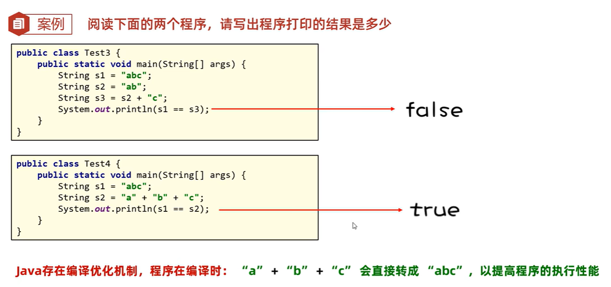
s3不是编译优化，把s2当成了一个变量，所以s2+"c"是运算，存放在堆内存;
"a"+"b"+"c"编译优化，放在字符串常量池

用户登录案例
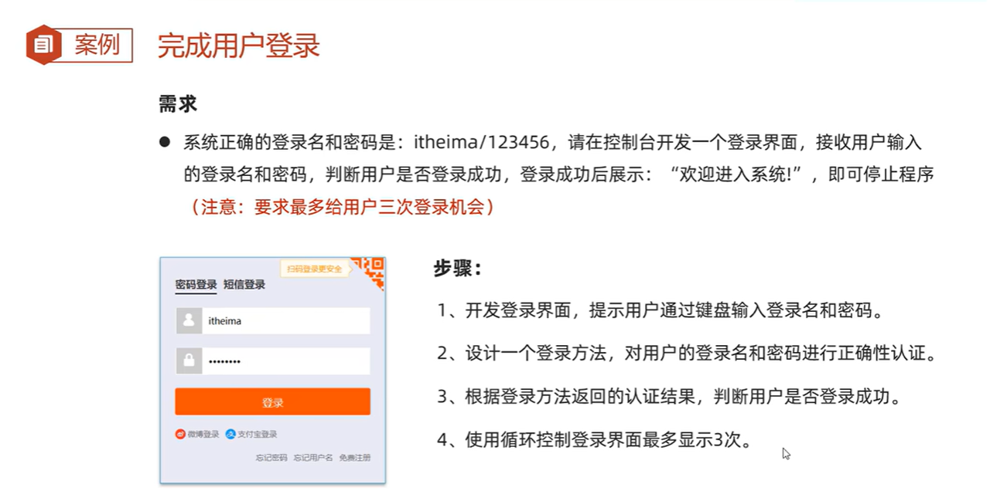
注意字符串比较用equal方法，直接比较内容，不然会有bug

==比较的是地址
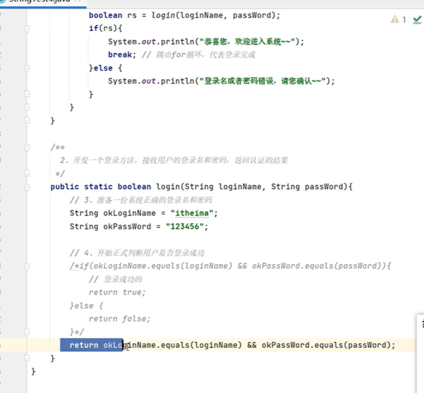
不是以双引号给出的，会放在堆内存
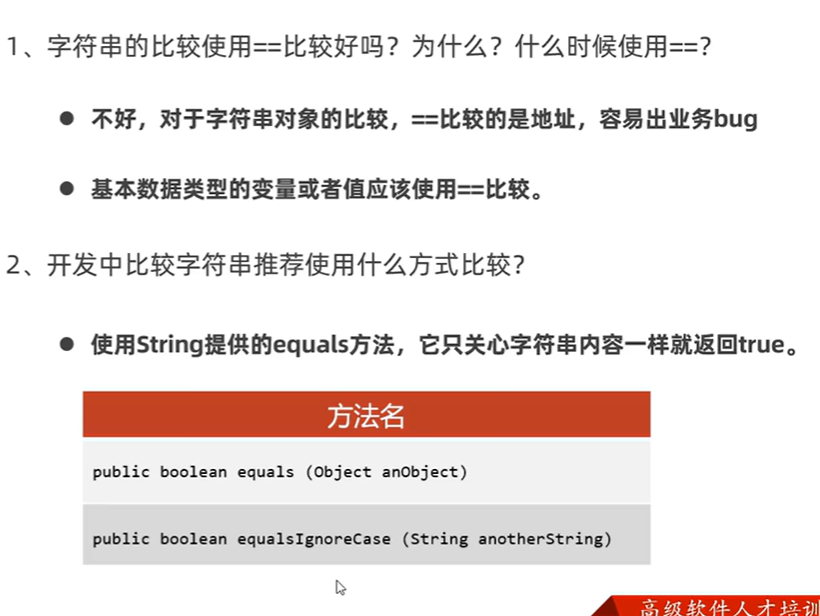

使用String开发验证码案例
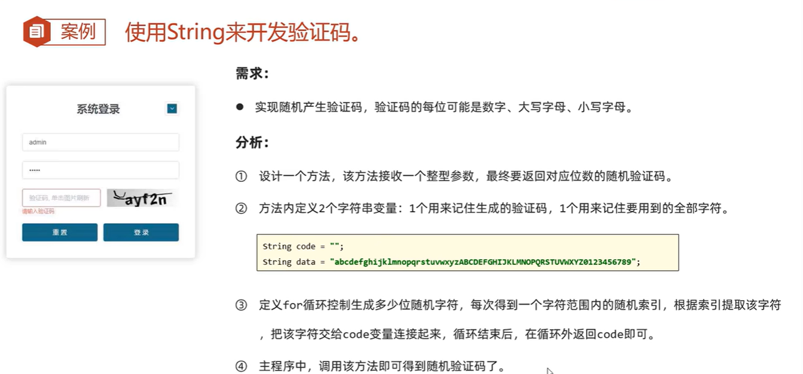
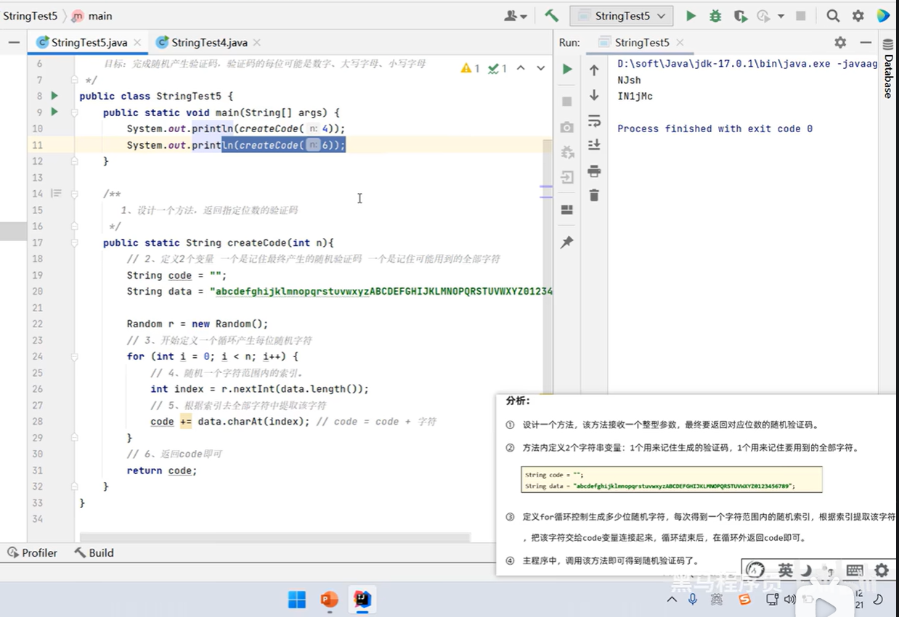